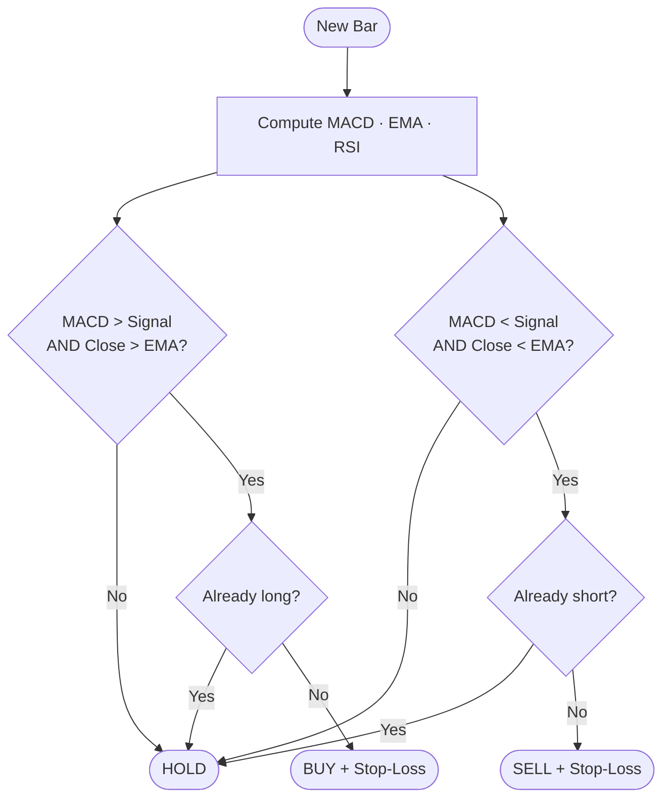
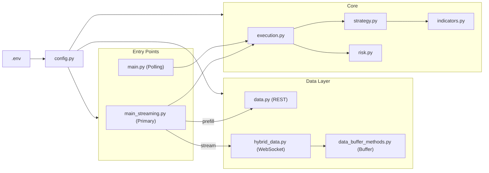
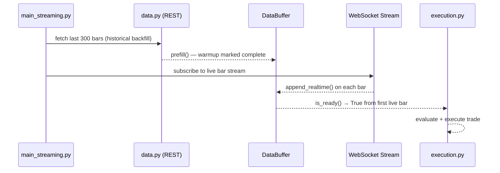

# Alpaca Trading Bot

An automated equity trading bot built with Python and the [Alpaca Markets API](https://alpaca.markets). Uses a real-time WebSocket bar stream as its primary data source, with a REST historical backfill at startup so it is ready to trade on the very first live bar.


---

## Overview

| Feature | Detail |
|---|---|
| **Strategy** | MACD crossover direction + EMA(20) trend filter |
| **Risk model** | ATR(14)-based stop distance · 2% equity risk per trade |
| **Stop-loss** | Placed automatically after every market order fill |
| **Startup** | Historical backfill primes indicators — no warmup wait |
| **Configurable** | All parameters controlled via `.env` — no code edits needed |

---

## Data Feed & Alpaca Tiers

Alpaca provides two data feeds. The feed you receive depends on your subscription:

| | Free Tier | Algo Trader Plus ($99/mo) |
|---|---|---|
| **Feed** | IEX (single exchange) | SIP (consolidated tape, all US exchanges) |
| **REST historical** | ~15 min delayed | Real-time |
| **WebSocket stream** | ~15 min delayed · max 30 symbols | Real-time · unlimited symbols |

> **For paper trading and strategy development the free IEX feed works perfectly.**
> Upgrade to Algo Trader Plus only when moving to live trading where execution latency matters.

This bot uses the **WebSocket stream** as its live data source. Historical bars are fetched via REST at startup only to prime the indicator buffer — the minor delay on that prefetch has no impact on live signal quality.

---

## Strategy

### Signal Logic

The bot combines **MACD direction** with an **EMA(20) trend filter** to avoid counter-trend trades in choppy markets.

```
BUY   when   MACD > Signal Line   AND   Close > EMA(20)
SELL  when   MACD < Signal Line   AND   Close < EMA(20)
HOLD  when   signals disagree
```

The EMA filter prevents shorting into an uptrend and buying into a downtrend — significantly reducing whipsaw on short timeframes compared to a raw MACD crossover.

### Decision Flowchart



### Configurable Strategy Modes

All toggles are set in `.env` — no code changes needed.

| `USE_MACD` | `USE_RSI` | `USE_EMA_FILTER` | Behaviour |
|:---:|:---:|:---:|---|
| ✅ | ❌ | ✅ | **Default** — MACD direction + EMA trend filter |
| ✅ | ✅ | ✅ | Conservative — MACD and RSI must agree + trend filter |
| ❌ | ✅ | ✅ | RSI oversold/overbought + trend filter |
| ✅ | ❌ | ❌ | Raw MACD crossover (no trend filter) |

---

## Risk Management

Position sizes are calculated dynamically on every trade using ATR-based stops and a fixed percentage-of-equity risk model.

```
Stop Distance  =  ATR(14)  ×  ATR_MULTIPLIER
Shares         =  (Equity  ×  RISK_PER_TRADE)  ÷  Stop Distance
```

A stop-loss order is placed immediately after every market order fill. If dynamic sizing fails (e.g. ATR unavailable), the bot falls back to 1 share with a 2% fixed stop.

---

## Architecture



### Startup Sequence (Streaming Mode)



### Module Responsibilities

| File | Responsibility |
|---|---|
| `config.py` | Single source of truth — loads `.env`, validates credentials, configures logging |
| `main_streaming.py` | **Primary** entry point — backfill + live stream |
| `main.py` | Polling fallback — 60 s REST loop with exponential backoff |
| `execution.py` | Translates signals into orders, places stop-losses |
| `strategy.py` | Evaluates indicators, applies EMA filter, returns `BUY / SELL / HOLD` |
| `indicators.py` | RSI · EMA · MACD calculations via `pandas-ta` |
| `risk.py` | ATR stop distance · dynamic position sizing |
| `data.py` | Fetches historical OHLCV bars via Alpaca REST |
| `hybrid_data.py` | Alpaca WebSocket subscription → `DataBuffer` |
| `data_buffer_methods.py` | Rolling in-memory bar buffer with prefill support |

---

## Setup

### 1. Clone

```bash
git clone https://github.com/your-username/trading-bot.git
cd trading-bot
```

### 2. Install dependencies

```bash
pip install -r requirements.txt
```

### 3. Configure credentials

```bash
cp .env.example .env
```

Open `.env` and fill in your [Alpaca API keys](https://alpaca.markets). Paper trading keys work out of the box and are free.

---

## Usage

### Streaming mode (recommended)

Fetches historical bars at startup to prime the indicators, then subscribes to the live bar stream. Ready to trade on the first live bar.

```bash
python main_streaming.py
```

### Polling mode (fallback)

Fetches the last 300 minutes of bars via REST on every 60-second cycle.

```bash
python main.py
```

Both modes prompt for a ticker symbol at startup (e.g. `AAPL`, `TSLA`, `SPY`).

### Example log output

```
2026-03-21 14:31:58  INFO     main_streaming   Fetching historical bars for AAPL to prime the buffer...
2026-03-21 14:31:59  INFO     data_buffer      Buffer prefilled with 300 historical bars — ready to trade
2026-03-21 14:31:59  INFO     hybrid_data      Stream subscribed for AAPL
2026-03-21 14:32:01  INFO     strategy         MACD=0.0234  Signal=0.0198  EMA=182.40  Close=183.10  RSI=54.2  → BUY
2026-03-21 14:32:01  INFO     execution        BUY order submitted | ticker=AAPL  qty=12
2026-03-21 14:32:01  INFO     execution        Stop-loss placed | side=sell  price=$181.84  qty=12
2026-03-21 14:32:01  INFO     main_streaming   Bar 2026-03-21 14:32:00 | decision=BUY   MACD=0.0234  EMA=182.40
```

---

## Configuration

All settings are controlled via environment variables in `.env`:

| Variable | Default | Description |
|---|---|---|
| `API_KEY` | — | Alpaca API key **(required)** |
| `SECRET_KEY` | — | Alpaca secret key **(required)** |
| `PAPER_TRADING` | `true` | `true` = paper trading, `false` = live |
| `USE_MACD` | `true` | Enable MACD crossover signal |
| `USE_RSI` | `false` | Enable RSI overbought/oversold filter |
| `USE_EMA_FILTER` | `true` | Only trade in direction of EMA(20) trend |
| `RISK_PER_TRADE` | `0.02` | Fraction of equity risked per trade (2%) |
| `ATR_MULTIPLIER` | `2.0` | Stop-loss width in ATR(14) units |
| `DYNAMIC_POSITION_SIZING` | `true` | ATR-based sizing vs. fixed 1 share |
| `LOOKBACK_MINUTES` | `300` | Historical bars fetched at startup for buffer prefill |
| `WARMUP_BARS` | `50` | Fallback warmup bars if prefill fails |
| `LOG_LEVEL` | `INFO` | `DEBUG` · `INFO` · `WARNING` · `ERROR` |

---

## Project Structure

```
trading-bot/
├── config.py                  # Centralised config & credential loading
├── main_streaming.py          # Primary entry point (backfill + live stream)
├── main.py                    # Polling entry point (fallback)
├── execution.py               # Order execution & stop-loss logic
├── strategy.py                # Signal evaluation (MACD + EMA filter)
├── indicators.py              # RSI, EMA, MACD (pandas-ta)
├── risk.py                    # Position sizing & ATR stop calculation
├── data.py                    # Historical bars (Alpaca REST)
├── data_buffer_methods.py     # Rolling bar buffer with prefill support
├── hybrid_data.py             # Real-time WebSocket bar subscription
├── .env.example               # Credentials & config template
├── .gitignore
└── requirements.txt
```

---

## Disclaimer

This project is for **educational purposes only**. It defaults to paper trading and carries no guarantee of profitability. Trading financial instruments involves significant risk of loss. Always backtest thoroughly before considering live deployment.
