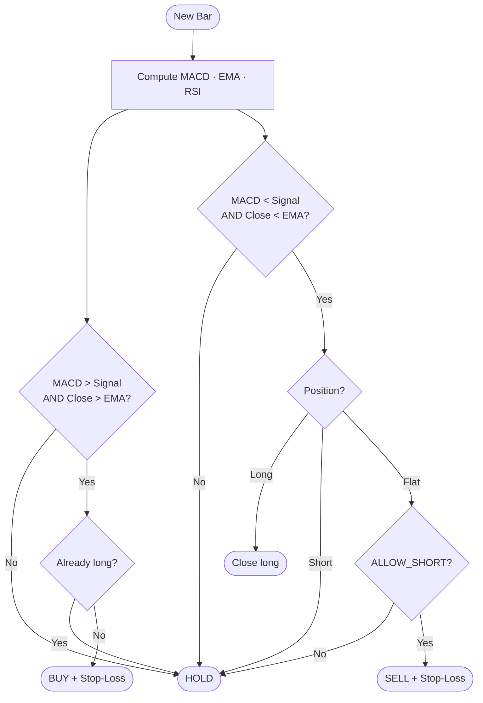
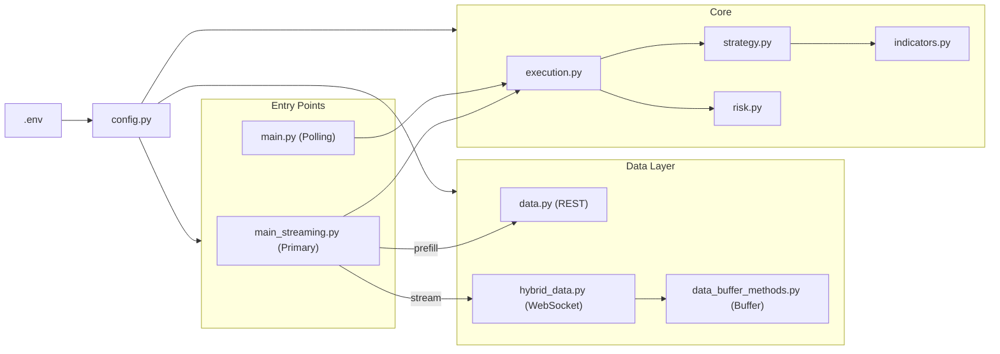
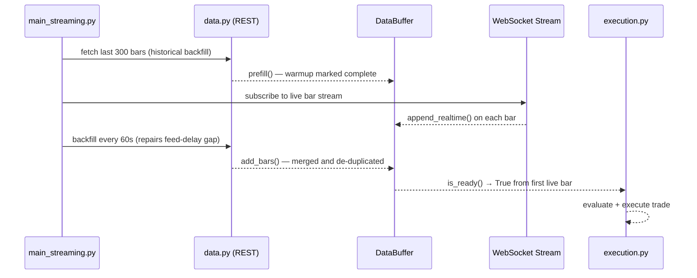

# Alpaca Trading Bot

An automated equity trading bot built with Python and the [Alpaca Markets API](https://alpaca.markets). Uses a real-time WebSocket bar stream as its primary data source, with a REST historical backfill at startup so it is ready to trade on the very first live bar.


---

## Overview

| Feature | Detail |
|---|---|
| **Strategy** | MACD crossover direction + EMA(20) trend filter |
| **Risk model** | ATR(14) stop distance · 2% equity risk · 25% notional cap per position |
| **Stop-loss** | **GTC** stop off the confirmed fill price · re-checked on every HOLD · position flattened if it cannot be placed |
| **Direction** | Long and short — reverses on signal flips; set `ALLOW_SHORT=false` for long-only |
| **Startup** | Historical backfill primes indicators — no warmup wait |
| **Configurable** | All parameters controlled via `.env` — no code edits needed |

---

## Data Feed & Alpaca Tiers

Alpaca provides two data feeds. The feed you receive depends on your subscription:

| | Free Tier | Algo Trader Plus ($99/mo) |
|---|---|---|
| **Feed** | IEX (single exchange) | SIP (consolidated tape, all US exchanges) |
| **REST historical** | ~15 min delayed | Real-time |
| **WebSocket stream** | ~15 min delayed · max 30 symbols | Real-time · unlimited symbols |

> **For paper trading and strategy development the free IEX feed works perfectly.**
> Upgrade to Algo Trader Plus only when moving to live trading where execution latency matters.

This bot uses the **WebSocket stream** as its live data source. Historical bars are fetched via REST at startup only to prime the indicator buffer.

On a delayed feed the newest historical bar is ~15 minutes old, so the startup prefill and the first streamed bar do not meet — leaving a hole in the buffer that indicators would silently compute across. A background task re-fetches recent bars every `BACKFILL_INTERVAL` seconds and merges them in, closing that gap as the delay window rolls forward. Merges de-duplicate by timestamp, with the REST bar taking precedence over a streamed one.

---

## Strategy

### Signal Logic

The bot combines **MACD direction** with an **EMA(20) trend filter** to avoid counter-trend trades in choppy markets.

```
BUY   when   MACD > Signal Line   AND   Close > EMA(20)
SELL  when   MACD < Signal Line   AND   Close < EMA(20)
HOLD  when   signals disagree
```

The EMA filter prevents shorting into an uptrend and buying into a downtrend — significantly reducing whipsaw on short timeframes compared to a raw MACD crossover.

### Decision Flowchart



### Configurable Strategy Modes

All toggles are set in `.env` — no code changes needed.

| `USE_MACD` | `USE_RSI` | `USE_EMA_FILTER` | Behaviour |
|:---:|:---:|:---:|---|
| ✅ | ❌ | ✅ | **Default** — MACD direction + EMA(20) trend filter |
| ✅ | ✅ | ✅ | MACD sets direction; RSI **vetoes** entry above 70 / below 30 |
| ❌ | ✅ | — | Pure RSI mean reversion at 30 / 70 — trend filter not applied |
| ✅ | ❌ | ❌ | Raw MACD crossover, long and short, no trend filter |

> **On combining RSI with a trend filter.** RSI mean reversion and an EMA trend filter
> pull in opposite directions: requiring `RSI < 30` *and* `close > EMA(20)` demands an
> oversold reading inside an uptrend, which is close to unsatisfiable. Earlier versions
> required exactly that, so the RSI modes almost never fired. RSI now acts as a veto
> alongside MACD rather than a second condition that must agree, and in RSI-only mode
> the trend filter is deliberately not applied.

---

## Risk Management

Position sizes are calculated dynamically on every trade using ATR-based stops and a fixed percentage-of-equity risk model, then bounded by two hard caps.

```
Stop Distance  =  ATR(14)  ×  ATR_MULTIPLIER
Risk Budget    =  (Equity × RISK_PER_TRADE)  ÷  Stop Distance
Shares         =  min( Risk Budget,
                       Equity × MAX_POSITION_PCT ÷ Price,
                       Buying Power ÷ Price )
```

On short intraday timeframes ATR is only cents wide, so the risk budget on its own asks for far more shares than the account should hold — the notional cap is usually what binds. If sizing cannot be computed (no account info, no ATR) the trade is skipped rather than sized arbitrarily.

### Stop-loss handling

`submit_order()` returns while the order is still `pending_new`, so the fill price is not yet known. The bot therefore:

1. cancels any resting orders for the symbol, so a stale stop cannot fire against the new position
2. submits the market order and **polls it to a terminal state** (up to `ORDER_FILL_TIMEOUT`)
3. places a **GTC** stop off the **actual average fill price**, for the quantity actually filled
4. retries once if placement fails — and flattens the position if it still fails, rather than running unprotected

#### Why the stop is GTC

A `DAY` stop is cancelled by the broker at the close, while the position itself survives into the next session. Earlier versions of this bot used `DAY`, which meant any position held overnight carried gap risk with nothing behind it — and because a `HOLD` decision took no action, the position could stay unprotected indefinitely.

Stops are now `GTC`, and as a second line of defence **every `HOLD` on an open position verifies that a correctly sized stop is actually resting**, rebuilding it off the broker's average entry price if it has gone missing or no longer matches the position size. If price has already moved through the level the stop would have fired at, the position is flattened instead — a stop on the wrong side of the market would simply be rejected.

#### What is still not guaranteed

A stop is not a floor. It becomes a market order when triggered, so a gap through the level fills below it, and the realised loss can exceed `RISK_PER_TRADE`. `MAX_POSITION_PCT` is also a **per-position** cap measured against total equity — running several instances on different symbols can therefore take on more aggregate exposure than any single one of them can see.

---

## Architecture



### Startup Sequence (Streaming Mode)



### Module Responsibilities

| File | Responsibility |
|---|---|
| `config.py` | Single source of truth — loads `.env`, validates credentials, configures logging |
| `main_streaming.py` | **Primary** entry point — backfill + live stream |
| `main.py` | Polling fallback — 60 s REST loop with exponential backoff |
| `execution.py` | Translates signals into orders, places stop-losses |
| `strategy.py` | Evaluates indicators, applies EMA filter, returns `BUY / SELL / HOLD` |
| `indicators.py` | RSI · EMA · MACD · ATR, implemented on pandas/numpy |
| `risk.py` | ATR stop distance · dynamic position sizing |
| `data.py` | Fetches historical OHLCV bars via Alpaca REST |
| `hybrid_data.py` | Alpaca WebSocket subscription → `DataBuffer` |
| `data_buffer_methods.py` | Rolling in-memory bar buffer with prefill support |

---

## Setup

### 1. Clone

```bash
git clone https://github.com/your-username/trading-bot.git
cd trading-bot
```

### 2. Install dependencies

Requires **Python 3.10+**. Dependencies are `alpaca-py`, `pandas`, `numpy` and `python-dotenv` — nothing heavier.

```bash
python -m venv .venv
source .venv/bin/activate        # Windows: .venv\Scripts\activate
pip install -r requirements.txt
```

> Indicators are implemented directly in `indicators.py` rather than via `pandas-ta`.
> That library pulls in `numba` and `llvmlite`, which restricted the project to Python
> 3.12–3.13 only (`pandas-ta` 0.4.x refuses < 3.12, and `numba` has no 3.14 build) —
> a narrow interpreter window in exchange for four short, standard formulas.

### 3. Configure credentials

```bash
cp .env.example .env
```

Open `.env` and fill in your [Alpaca API keys](https://alpaca.markets). Paper trading keys work out of the box and are free.

---

## Usage

### Streaming mode (recommended)

Fetches historical bars at startup to prime the indicators, then subscribes to the live bar stream. Ready to trade on the first live bar.

```bash
python main_streaming.py
```

### Polling mode (fallback)

Fetches the last 300 minutes of bars via REST on every 60-second cycle.

```bash
python main.py
```

Both modes prompt for a ticker symbol at startup (e.g. `AAPL`, `TSLA`, `SPY`).

### Example log output

```
2026-03-21 14:31:58  INFO     main_streaming   Fetching historical bars for AAPL to prime the buffer...
2026-03-21 14:31:59  INFO     data_buffer      Buffer prefilled with 300 historical bars — ready to trade
2026-03-21 14:31:59  INFO     hybrid_data      Stream subscribed for AAPL
2026-03-21 14:32:01  INFO     strategy         MACD=0.0234  Signal=0.0198  EMA=182.40  Close=183.10  RSI=54.2  → BUY
2026-03-21 14:32:01  INFO     execution        BUY order submitted | ticker=AAPL  qty=12
2026-03-21 14:32:01  INFO     execution        Stop-loss placed | side=sell  price=$181.84  qty=12
2026-03-21 14:32:01  INFO     main_streaming   Bar 2026-03-21 14:32:00 | decision=BUY   MACD=0.0234  EMA=182.40
```

---

## Tests

```bash
pip install -r requirements-dev.txt
pytest -q
```

89 tests, no credentials and no network required — the Alpaca clients are built lazily,
so every module imports and the order-routing logic runs against a fake client.

| File | Covers |
|---|---|
| `test_indicators.py` | RSI · EMA · MACD · ATR against hand-derived values, including a cross-check of RSI against an independently written textbook Wilder implementation, and NaN-on-short-window behaviour |
| `test_risk.py` | Which of the three sizing caps binds, and every refusal path (zero price, zero stop distance, account too small) |
| `test_execution.py` | Position transitions, reversal sizing, GTC stops, and the stop re-assertion paths |
| `test_strategy.py` | Signal rules per toggle combination, including regression cover for two rules that were unreachable |
| `test_data.py` | The `normalise_bars` schema contract every other module relies on |
| `test_offline_import.py` | That no module builds an Alpaca client at import — the invariant the rest of the suite depends on |

---

## Configuration

All settings are controlled via environment variables in `.env`:

| Variable | Default | Description |
|---|---|---|
| `API_KEY` | — | Alpaca API key **(required)** |
| `SECRET_KEY` | — | Alpaca secret key **(required)** |
| `PAPER_TRADING` | `true` | `true` = paper trading, `false` = live |
| `USE_MACD` | `true` | Enable MACD crossover signal |
| `USE_RSI` | `false` | Enable RSI overbought/oversold filter |
| `USE_EMA_FILTER` | `true` | Only trade in direction of EMA(20) trend |
| `RISK_PER_TRADE` | `0.02` | Fraction of equity risked per trade (2%) |
| `ATR_MULTIPLIER` | `2.0` | Stop-loss width in ATR(14) units |
| `DYNAMIC_POSITION_SIZING` | `true` | ATR-based sizing vs. fixed 1 share |
| `ALLOW_SHORT` | `true` | `true` = a SELL from flat opens a short; `false` = exit longs only |
| `MAX_POSITION_PCT` | `0.25` | Hard cap on position notional as a fraction of equity |
| `ORDER_FILL_TIMEOUT` | `10` | Seconds to wait for a market order to fill before giving up |
| `LOOKBACK_MINUTES` | `300` | Historical bars fetched at startup for buffer prefill |
| `WARMUP_BARS` | `50` | Fallback warmup bars if prefill fails |
| `DATA_FEED` | `iex` | `iex` (free tier) or `sip` (Algo Trader Plus) |
| `BACKFILL_INTERVAL` | `60` | Seconds between REST backfills that repair delayed-feed gaps |
| `LOG_LEVEL` | `INFO` | `DEBUG` · `INFO` · `WARNING` · `ERROR` |

---

## Project Structure

```
trading-bot/
├── config.py                  # Centralised config & credential loading
├── main_streaming.py          # Primary entry point (backfill + live stream)
├── main.py                    # Polling entry point (fallback)
├── execution.py               # Order execution & stop-loss logic
├── strategy.py                # Signal evaluation (MACD + EMA filter)
├── indicators.py              # RSI, EMA, MACD, ATR (pandas/numpy)
├── risk.py                    # Position sizing & ATR stop calculation
├── data.py                    # Historical bars (Alpaca REST)
├── data_buffer_methods.py     # Rolling bar buffer with prefill support
├── hybrid_data.py             # Real-time WebSocket bar subscription
├── tests/                     # 89 tests — no credentials or network needed
│   ├── conftest.py            #   OHLCV fixture in the normalise_bars shape
│   ├── test_indicators.py
│   ├── test_risk.py
│   ├── test_execution.py      #   fake Alpaca client
│   ├── test_strategy.py
│   ├── test_data.py
│   └── test_offline_import.py
├── .env.example               # Credentials & config template
├── .gitignore
├── requirements.txt
└── requirements-dev.txt       # requirements.txt + pytest
```

---

## Disclaimer

This project is for **educational purposes only**. It defaults to paper trading and carries no guarantee of profitability. Trading financial instruments involves significant risk of loss. Always backtest thoroughly before considering live deployment.
